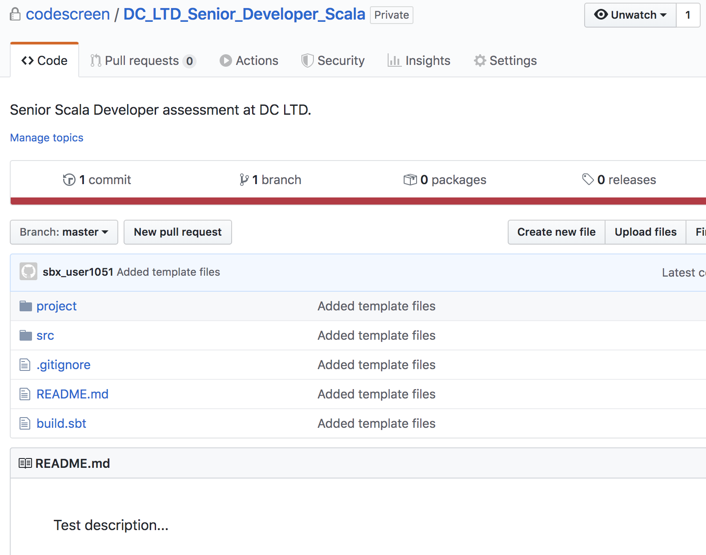

# Creating Custom Scala Assessments
CodeScreen allows you to add your own assessment and send it to candidates.  
To begin, log on to [CodeScreen](https://app.codescreen.dev/#/login), click <strong>Add new test</strong>, and select <strong>Custom test</strong>. 

You can then add the description of your test, choose <strong>Scala</strong> from the drop-down list of available backend languages, and set the time limit for the test. 

Once you click <strong>Publish</strong>, a private GitHub repository will be created in the CodeScreen account, and you will be given access.
This repository will contain a skeleton <strong>SBT</strong> project, and the README will contain the description of the test that you added during the setup.  

<figure>
  <figcaption style="font-style: italic;">Example custom Scala assessment GitHub repository:</figcaption>
   
  
</figure>

  

### Automated test-suite setup

If you would like to add tests that are automatically run by CodeScreen against each candidate's solution to your assessment, you can add these as test classes in the `src/test/` directory.

All unit tests must end with `Test.scala` and all tests that end with `HiddenTest.scala` will not be visible to the candidate.

All unit tests must use the [`JUnit`](https://junit.org/junit5/) test framework.

The name of the project in the `build.sbt` must be updated to better match your assessment, and any dependencies required for your coding test must be added to the `build.sbt` file.

The `Scala` version that must be used is 2.12.1.

The maximum memory allowed for a solution to your coding test is 4G.

### Examples

An **example** `Scala` assessment that uses automated test suite scoring can be seen here: 
https://github.com/Code-Screen/Scala-CodeScreen-Fibonacci
