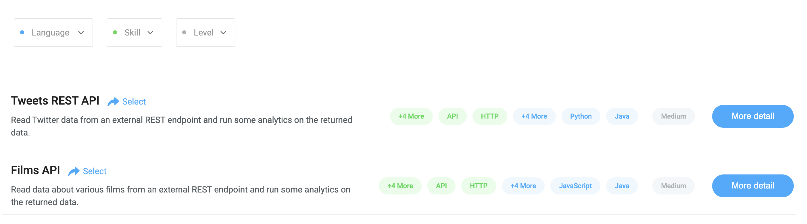

# Selecting a Library assessment

When you click `Add new assessment` on CodeScreen, you will be given the following two choices:

<figure>
  <figcaption style="font-style: italic;"></figcaption>
   
  
</figure>

`Library assessments` are assessments that we provide off the shelf for you to use. **Note** if you want to learn more about
`Custom assessments`, click [here](custom-assessment-concepts.md).

Once you click the `Library assessment` button, you will see the following screen which contains a summary of each of our library assessments:

<figure>
  <figcaption style="font-style: italic;"></figcaption>
   
  
</figure>

 

You can filter these assessments based on which `language/framework` the assessment is available in,
 which `skills` are assessed during the assessment, and what the `difficulty level` of the assessment is.

Each assessment is available in multiple languages/frameworks and assesses various skills (e.g. Databases, APIs, REST, etc.).

The difficulty level attached to each assessment will be one of the following three values:

 * **Easy** - New Grad/1 year experience.
 * **Medium** - Junior/Medium level developer. 2 - 5 years experience.
 * **Hard** - Senior developer. 5+ years experience.

To find out more information about a assessment, click the `More detail` blue button:

<figure>
  <figcaption style="font-style: italic;"></figcaption>
   
  
</figure>

 

The `More detail` section contains the full list of skills assessed during the assessment and a link to the GitHub repository for each language the assessment is available in. Each repository contains a full description of the assessment.

To select a assessment, just click the `Select` arrow button beside the name of the assessment you want to select. Once you select a assessment, you will be brought to the [Create Library assessment](creating-library-assessment.md) screen.
