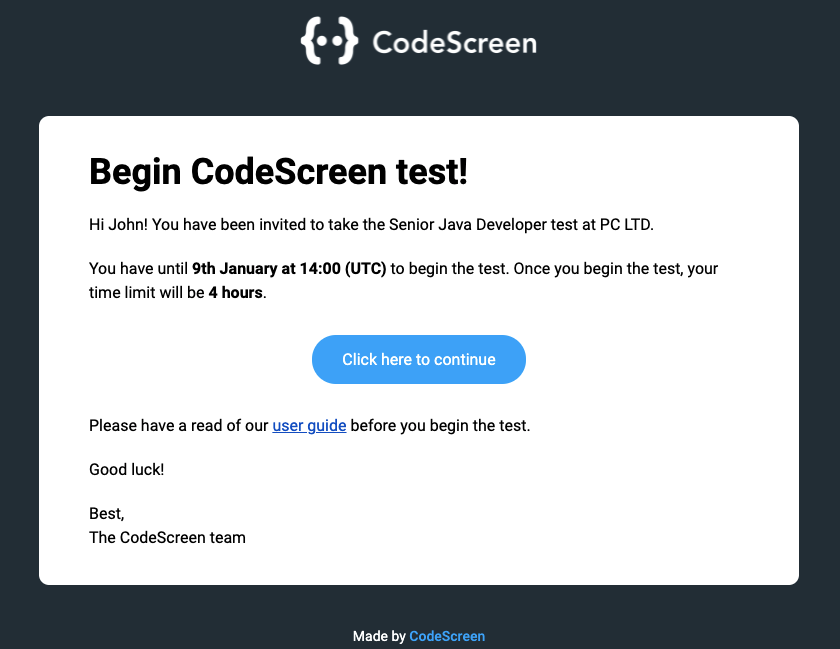

# Send Assessment

The ```
POST https://app.codescreen.com/api/assessments
``` endpoint allows you to send a CodeScreen assessment to a candidate.


### Request

The body of this POST request will contain a JSON payload with the following fields: </br>

<table>
<thead>
<tr>
<td style="white-space: nowrap;">Property Name</td><td>Type</td><td>Required</td><td>Description</td></tr>
</thead><tbody>
<tr>
<td>assessmentId</td><td>String</td><td>Yes</td><td>The unique identifier of the assessment that you are sending to a candidate. Initially provided as a response to the <a href="#list-assessments-endpoint">List Assessments endpoint</a>.</td></tr>
<tr>
<td>firstName</td><td>String</td><td>Yes</td><td>The first name of the candidate.</td></tr>
<tr>
<td>lastName</td><td>String</td><td>Yes</td><td>The last name of the candidate.</td></tr>
<td>email</td><td>String</td><td>Yes</td><td>The candidate’s email address. The assessment link will be sent to this address.</td></tr>
</tbody></table>

<br/>An example request is shown below:

```
curl -X POST https://app.codescreen.com/api/assessments \
  -H 'Authorization: apiKey dbf4a385-02ab-7d10-bf0c-5hh991055317' \
  -H 'Content-Type: application/json' \
  -d '{
    "assessmentId": "af401f8e-24d9-4889-ad8b-39cc8366b0ac",
    "firstName": "John",
    "lastName": "Smith",
	"email" : "john.smith@gmail.com"
}'

```

### Response

If the request has succeeded, the response will be a `200 OK` containing JSON with the following properties:

<table>
<thead>
<tr>
<td style="white-space: nowrap;">Property Name</td><td>Type</td><td>Required</td><td>Description</td></tr>
</thead><tbody>
<tr>
<td>assessmentInstanceId</td><td>String</td><td>Yes</td><td>The unique identifier for the assessment instance that was send to the candidate. This id can be used to track the status of this assessment using the <a href="#get-assessment-status-endpoint">Get Assessment Status endpoint</a>.</td></tr>
</tbody></table>

An example response is shown below:

```
{
    "assessmentInstanceId": "1b68dc27-6155-41c2-89e3-4e00bd62d227"
}

```

<br/>The candidate is then sent an email to begin the assessment:


