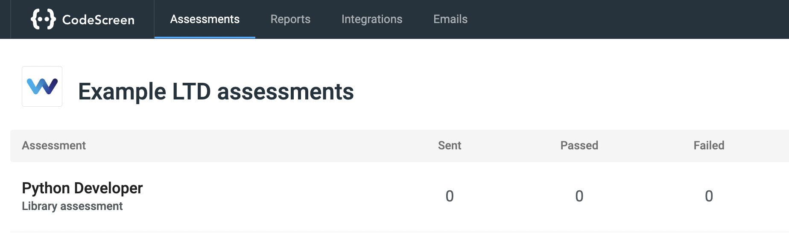
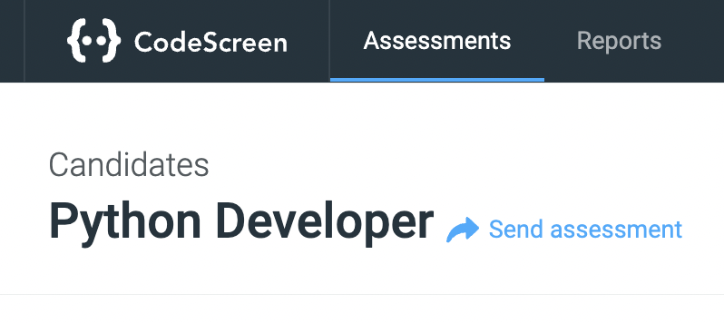
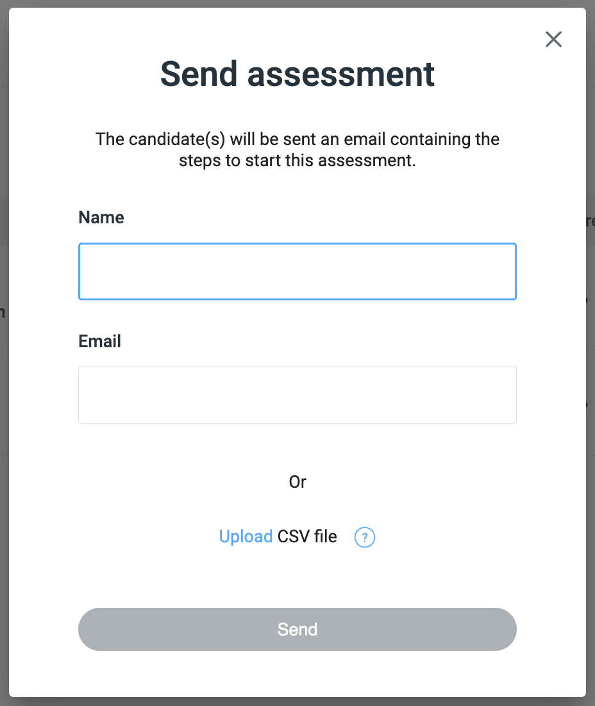
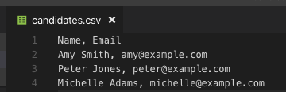

# Sending assessments

Once you create your first assessment, you can then send the assessment to candidates.

To do this, click on the row for the assessment on the homepage screen:

<figure>
  <figcaption style="font-style: italic;"></figcaption>
   
  
</figure>

Then click the `Send assessment` link beside the assessment name.

<figure>
  <figcaption style="font-style: italic;"></figcaption>
   
  
</figure>

**Note** you can also send assessments directly from your `Applicant Tracking System (ATS)` if you use an ATS that we integrate with. Check our ATS integration guides [here](integrating-greenhouse-with-codescreen.md).

Once you click `Send assessment`, you will see the following pop-up:

<figure>
  <figcaption style="font-style: italic;"></figcaption>
   
  
</figure>

 

If you would like to send the assessment to a single candidate, you can enter the candidate's `Name` and `Email`, then click the `Send` button.

Alternatively, if you would like to send the assessment to multiple candidates at once, you can upload a CSV file containing each candidate's `Name` and `Email`. Once the file is uploaded, then click the `Send` button.

**Note** the CSV file headers must be `Name` and `Email`. Here is an example of a valid CSV file:

<figure>
  <figcaption style="font-style: italic;"></figcaption>
   
  
</figure>

 

Once the assessment is sent, the candidate(s) will receive an email containing instructions on how to start the assessment.

To read more about the workflow for the candidate, click <a href="https://docs.codescreen.com/candidates/#/intro" target="_blank">here</a>.

Once the assessment has been sent, you will then [see a table](viewing-candidates.md) that contains all the candidates that this assessment has been sent to.
