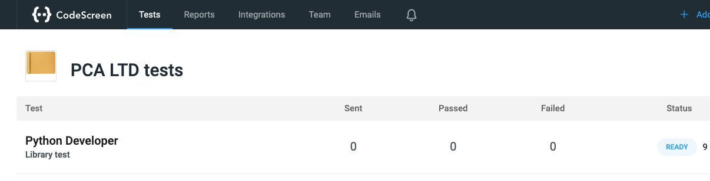
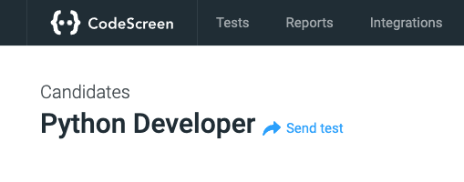
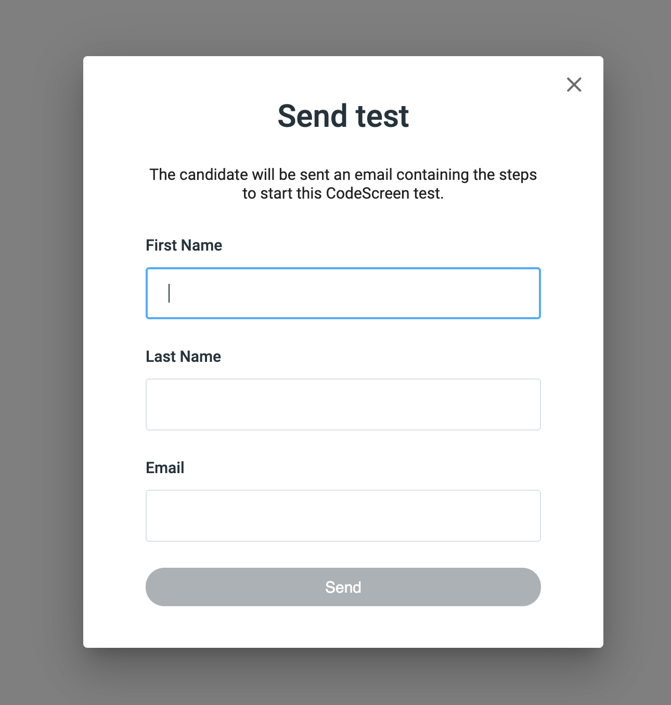

# Sending Tests

Once you create your first Test, you can then send the test to candidates.

To do this, click on the row for the test on the homepage screen:

<figure>
  <figcaption style="font-style: italic;"></figcaption>
   
  
</figure>

Then click the `Send test` link beside the test name.

<figure>
  <figcaption style="font-style: italic;"></figcaption>
   
  
</figure>

**Note** you can also send tests directly from your `Applicant Tracking System (ATS)` if you use an ATS that we integrate with. Check our ATS integration guides [here](greenhouse.md).

Once you click `Send test`, you will see the following pop-up:

<figure>
  <figcaption style="font-style: italic;"></figcaption>
   
  
</figure>

Enter the candidate's `First Name`, `Last Name`, and `Email Address`, then click the `Send` button.

The candidate will receive an email containing instructions on how to start the test.

To read more about the workflow for the candidate, click <a href="https://code-screen.github.io/Candidates-Docs/#/README" target="_blank">here</a>.

Once the test has been sent, you will then [see a table](candidateList.md) that contains all the candidates that this test has been sent to.
