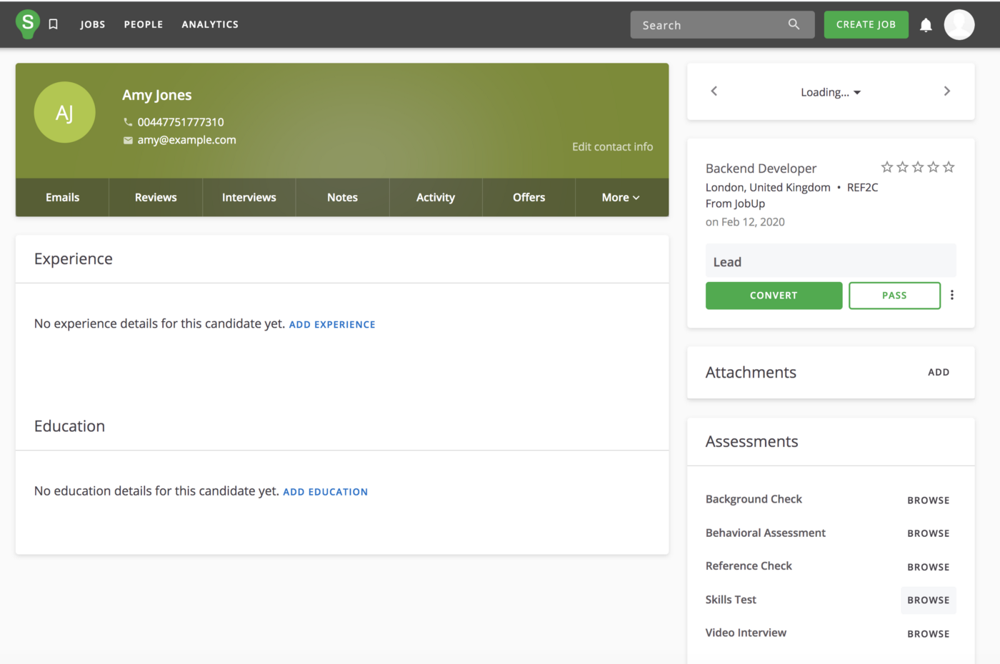
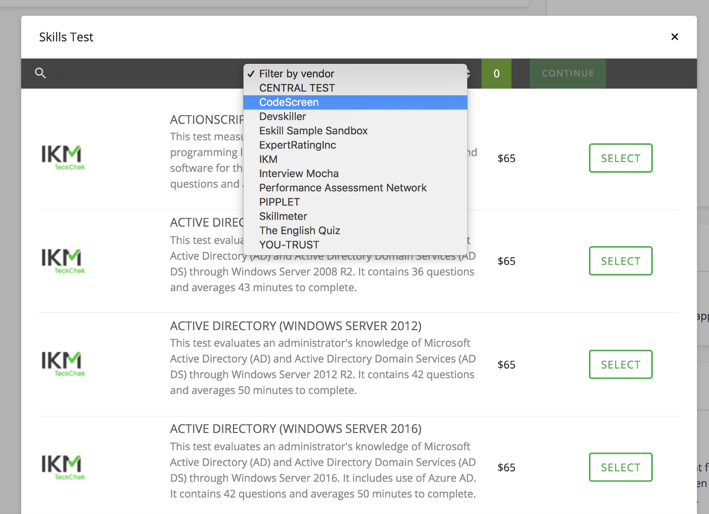
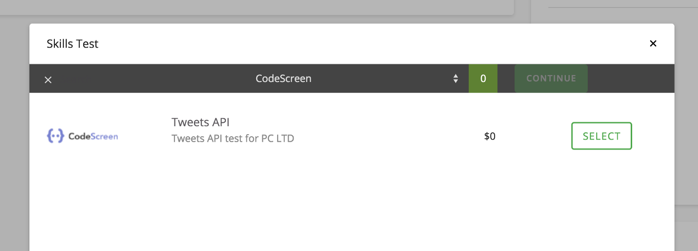
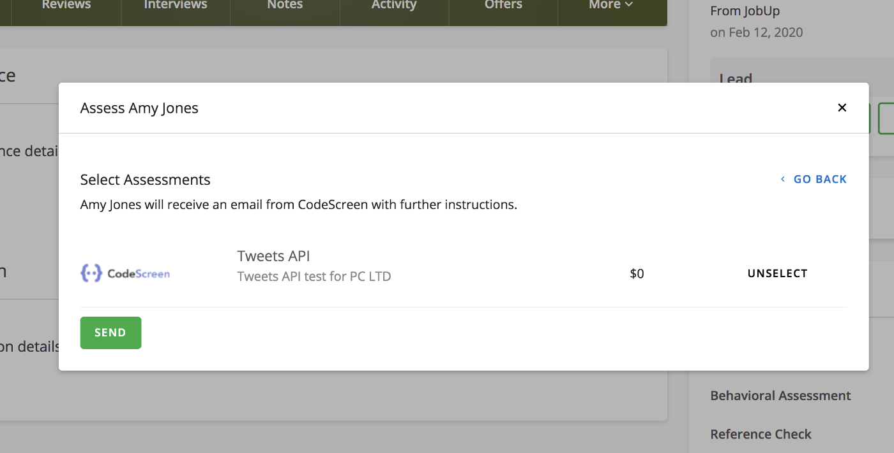
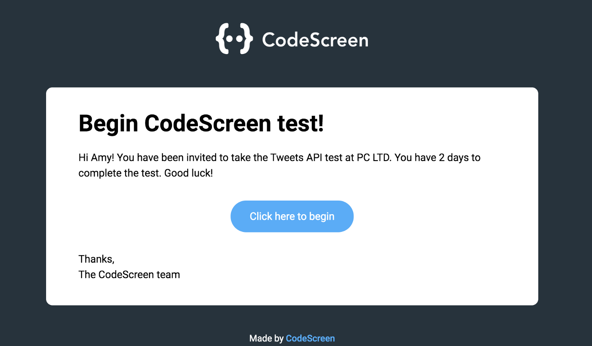
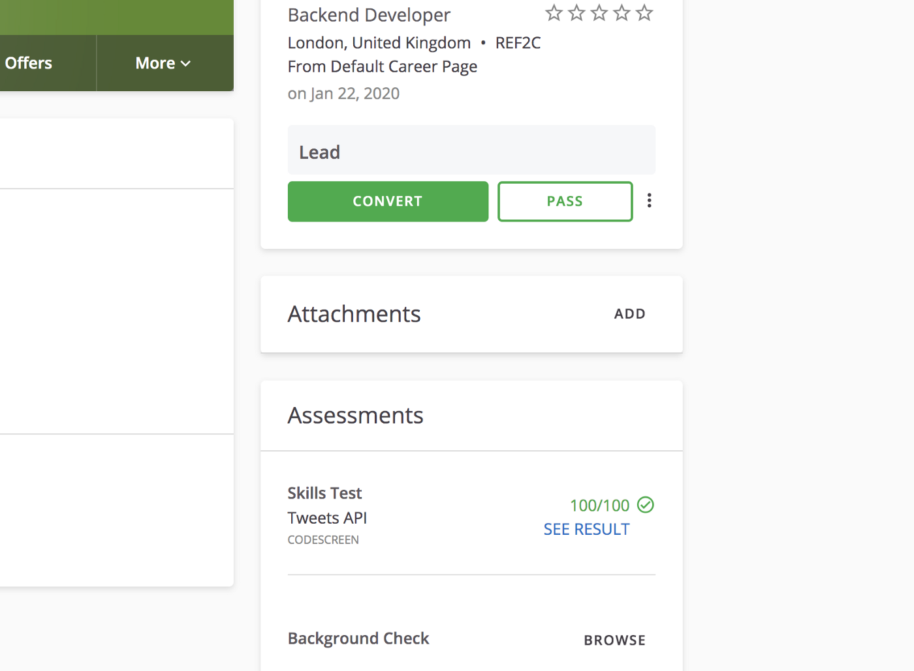
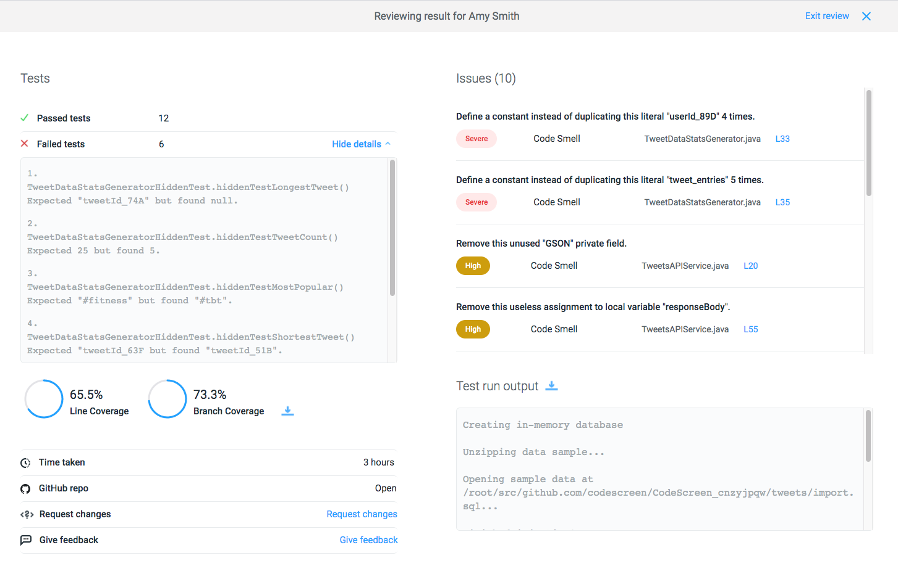

# Integrating SmartRecruiters with CodeScreen

<figure>
  <figcaption style="font-style: italic;"></figcaption>
   
  
</figure>

The `CodeScreen` integration with `SmartRecruiters` allows you to do the following:

* Select which CodeScreen test is required for each role you have on SmartRecruiters.
* Invite candidates to take CodeScreen tests directly from the SmartRecruiters platform as candidates enter the assessment stage.
* Status updates from invitation to completion.
* Have candidate CodeScreen test reports automatically attach to their SmartRecruiters candidate profile and their scores displayed.

The integration is quick and straightforward. It works as follows:

### 1. Enable the SmartRecruiters/CodeScreen Integration
To do this, first, let your contact at SmartRecruiters know that you would like to integrate with CodeScreen.   They will then send us your SmartRecruiters customer ID, which we will add to your CodeScreen account, and we will notify you that the integration has been enabled.

### 2. Send CodeScreen test to a candidate
Once the SmartRecruiters <> CodeScreen integration is enabled for your organization, you will be able to start sending CodeScreen assessments to candidates via the SmartRecruiters platform.

To do this for an existing candidate, navigate to the candidate, and click `Browse` beside `Skills Tests` in the `Assessments` section in the bottom right of the screen.

<figure>
  <figcaption style="font-style: italic;"></figcaption>
   
  
</figure>

You will then see a list of skill test providers, and you can find the available CodeScreen tests by choosing CodeScreen from the filter list.

<figure>
  <figcaption style="font-style: italic;"></figcaption>
   
  
</figure>

There will be one entry in this list for each test that you currently have set up on CodeScreen:

<figure>
  <figcaption style="font-style: italic;"></figcaption>
   
  
</figure>

Click `Select`, then click `Continue` and finally click `Send` to send the test to the candidate.

<figure>
  <figcaption style="font-style: italic;"></figcaption>
   
  
</figure>

When you click Send, CodeScreen sends an email to the candidate containing the instructions for the test.

You are able to edit the email templates that are used to include your own wording and your company’s branding. 
You can read more details about this [here](templates.md). 

The default email template looks like the following:

<figure>
  <figcaption style="font-style: italic;"></figcaption>
   
  
</figure>

### 3. Review the Test
Once the candidate has submitted their test, you will be notified via email by SmartRecruiters, and the result will be viewable on the SmartRecruiters’s page for that candidate:

<figure>
  <figcaption style="font-style: italic;"></figcaption>
   
  
</figure>

Once you click `SEE RESULT`, you will be redirected to the result page on the CodeScreen platform:

<figure>
  <figcaption style="font-style: italic;"></figcaption>
   
  
</figure>

And that’s it!

A video demo showing the integration in action is available to view 
<a href="https://www.youtube.com/watch?v=4EI5a84oU7k" target="_blank">here</a>.

