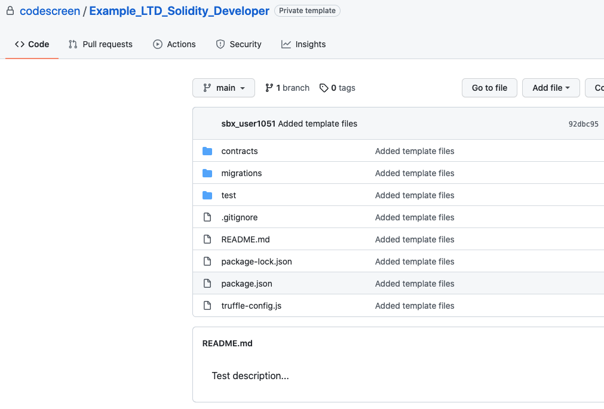

# Creating Custom Solidity Assessments
CodeScreen allows you to add your own assessment and send it to candidates.  
To begin, log on to [CodeScreen](https://app.codescreen.dev/#/login), click <strong>Add new test</strong>, and select <strong>Custom test</strong>. 

You can then add the description of your test, choose <strong>Solidity</strong> from the drop-down list of available backend languages, and set the time limit for the test. 

Once you click <strong>Publish</strong>, a private GitHub repository will be created in the CodeScreen account, and you will be given access.
This repository will contain a skeleton <strong>Solidity</strong> project, and the README will contain the description of the test that you added during the setup.  

<figure>
  <figcaption style="font-style: italic;">Example custom Solidity assessment GitHub repository:</figcaption>
   
  
</figure>

  

### Automated test-suite setup

If you would like to add tests that are automatically run by CodeScreen against each candidate's solution to your assessment, you can add these as test files in the `test/` directory.

All unit tests must use the `Truffle` testing framework. They can be written in either `Solidity` or `JavaScript`.

All unit test file names must end with `Test.js` or `Test.sol`, and all unit test files with file names ending with `HiddenTest.js` or `HiddenTest.sol` will not be visible to the candidate.

The `package.json` file should only be modified in order to add any third-party dependencies required for your solution. The `truffle` and `truffle-assertions` versions should not be changed.

The `pragma` version also must not be changed.

The coding test must be compatible with Node.js version `15.5.1`.

The maximum memory allowed for a solution to your coding test is 4G.

The maximum size that this repo can be is 400MB.

### Examples

An **example** `Solidity` assessment that uses automated test suite scoring can be seen here: 
https://github.com/Code-Screen/Solidity-CodeScreen-Fibonacci
