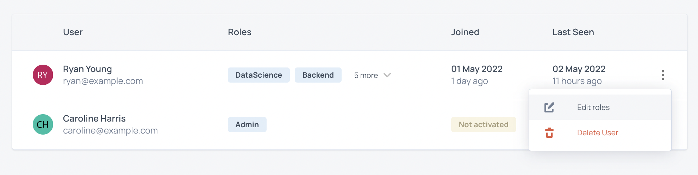

# User Roles

The person who initially creates the account for your organization on CodeScreen is given the `Admin` role by default.

Users with the `Admin` role can edit email templates, add/edit/delete other users, view API & ATS keys, enforce security policies, view audit logs and access/update your account's billing details.

Our other roles have been modelled on a typical software developent team structure, so each role maps to a test category, e.g. the `Backend` role refers to backend tests (Python, Java, etc.), the `Frontend` role refers to frontend tests (React, Angular, etc.).

A list of all non-admin roles (and the languages/frameworks it covers) is given below:

- `Backend` - Java, Scala, Kotlin, Python, Node.js, PHP, .NET, Go, Haskell, Rust, Ruby, Elixir, Solidity, C++.
- `Frontend` - Angular, React, Vue.js, Web.
- `FullStack` - Django, Rails, WordPress, Java + Angular, etc.
- `Mobile` - Swift, React Native.
- `DevOps` - Terraform.
- `DBA` - SQL.
- `DataScience` - R.

For a user that has a certain role, they can add/edit/delete tests in that role's category, view results for tests in that category and send new tests out to candidates in that category.

### Editing Roles

If you want to edit the roles of an existing user, you can click on the 3 bullet point icon to the right of the user's row and then click `Edit roles`:

<figure>
  <figcaption style="font-style: italic;"></figcaption>
   
  
</figure>

**Note** that once you edit the roles for a user, the user will need to log out of CodeScreen & log back in for the changes to take effect.
