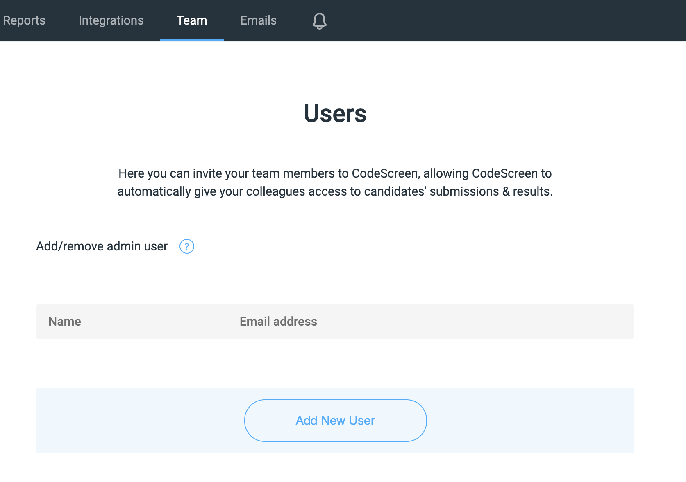
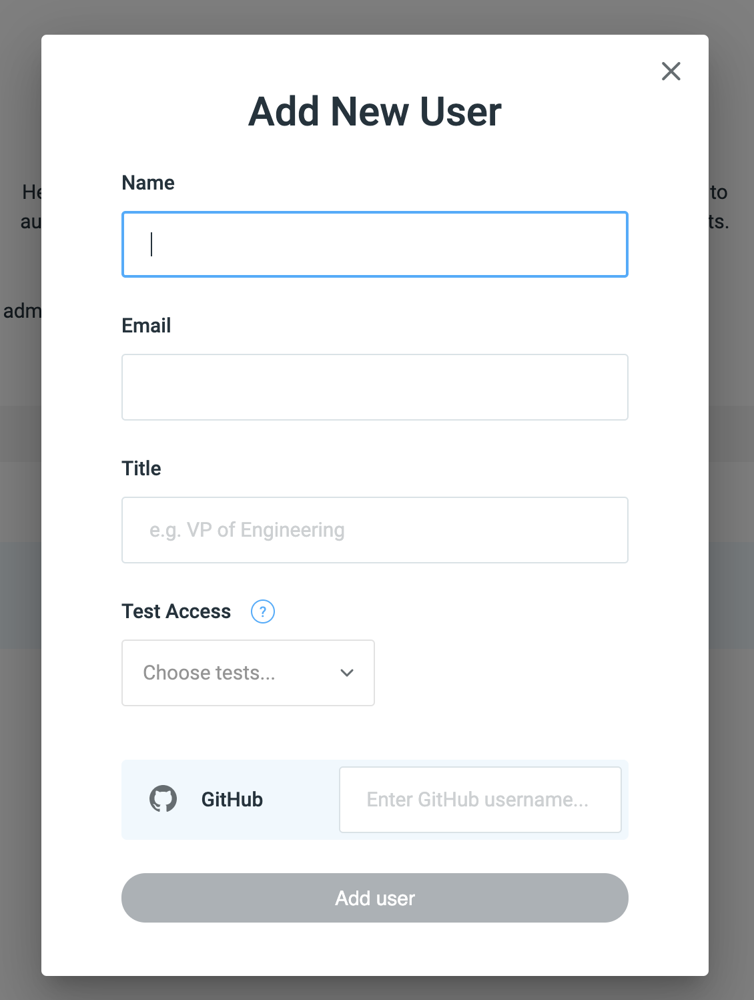

# Adding Users

CodeScreen has been built in a way that makes it easy for any of your colleagues (recruiters, hiring managers, and developers)
to use.

You can create as many users as you like as all of our pricing plans come with an unlimited number of users.

You can view all existing users by clicking the
<a href="https://app.codescreen.dev/#/client-templates" target="_blank">Team</a> section on the top toolbar on CodeScreen, 
which will take you to the following screen:

<figure>
  <figcaption style="font-style: italic;"></figcaption>
   
  
</figure>

**Note** that you will not have access to the Teams section on CodeScreen unless you are an admin user. If you are not
an admin, please contact one of the admin users in your organization, and they will be able to make you an admin.

You can then add a new user by clicking the `Add New User` button, which will launch the following pop-up:

<figure>
  <figcaption style="font-style: italic;"></figcaption>
   
  
</figure>

You can enter the user's `Name`, `Email`, and `Title`. 

You can then select which tests you want to give this user access to.
For each test you select, this user will be able to send tests to candidates, see all results (including access to each candidate's GitHub repo), access to the test's `GitHub` template repos (for custom tests), and be notified when each candidate completes the test.
  If you don't select any tests, then the user will be granted access to all tests.

You can also add the user's `GitHub` username. If you are adding a non-technical user you can leave this blank. If you are
adding a technical user (developer, tech lead, etc), then you can also leave this blank and the user can add it later when
they sign in for the first time.

You can now click the `Add user` to finish adding the user. The user will then be sent a welcome email containing a link
to sign in for the first time.

 ### Admin Users
 The person who initially creates the account for your organisation on CodeScreen is made an admin user by default.

 When a new user is added, they will be created by default as non-admin users. If you would like to change a non-admin user
 to an admin, please message us on our live chat, or via <a href="mailto:hello@codescreen.dev">email</a>, with the name of the user and we will update them on our side.
