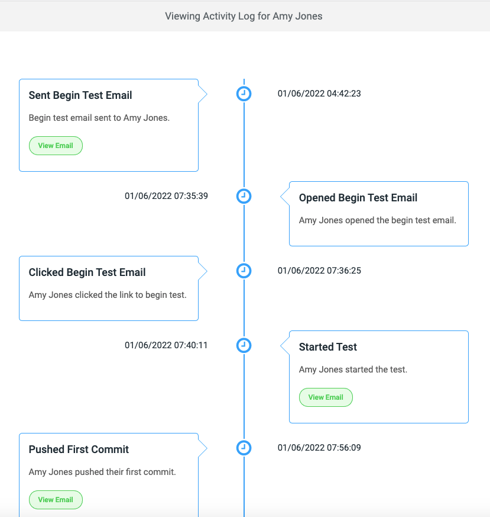

# Activity Log

There is an `Activity Log` available for each candidate, which provides a real-time overview of how a candidate is progressing through your test.   This makes it very easy for you to track candidates’ journeys through your tests.

<figure>
  <figcaption style="font-style: italic;"></figcaption>
   
  
</figure>

