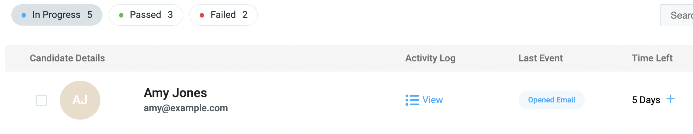
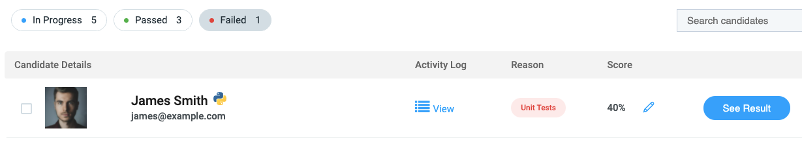

# Viewing Candidates

When you click into an assessment from the home screen, you will see a table containing all the candidates you have sent the assessment to.

This table is broken into three different sections:

`In Progress` - Candidates who have been sent the assessment but have not yet started/finished.

`Passed` - Candidates who have passed the assessment.

`Failed` - Candidates who have failed the assessment.

<figure>
  <figcaption style="font-style: italic;"></figcaption>
   
  
</figure>

 

An [Activity Log](viewing-activity-log.md) is available for each candidate, which provides a real-time overview of how a candidate is progressing through your assessment.

### In Progress

In the In Progress section, the `Time Left` initially shows how long the candidate has to start the assessment (based on the Deadline value for your assessment). Once a candidate starts their assessment, it shows how long they have to complete the assessment (based on the Time Limit value for your assessment). 

There is also a `Last Event` column showing which step each candidate is at when taking one of your assessments. The full list of event types (and an explanation on when each is created) are given in the table below:

<table>
<thead>
<tr>
<td style="white-space: nowrap;"><strong>Event</strong></td><td><strong>Description</strong></td></tr>
</thead><tbody>
<tr>
<td style="color: #e96900;">Sent Email</td><td>A candidate is initially sent an assessment.</td>
</tr>
<tr style="background-color: white;">
<td style="color: #e96900;">Opened Email</td><td>A candidate opens the email that is sent to them containing the link to start their assessment.</td>
</tr>
<tr>
<td style="color: #e96900;">Clicked Email</td><td>A candidate clicks the link to start their assessment.</td>
</tr>
<tr style="background-color: white;">
<td style="color: #e96900;">Started</td><td>A candidate begins the assessment.</td>
</tr>
<tr>
<td style="color: #e96900;">Pushed First Commit</td><td>A candidate pushes their first commit to the GitHub repo created for their assessment.</td>
</tr>
<tr style="background-color: white;">
<td style="color: #e96900;">Completed</td><td>A candidate submits their solution to their assessment.</td>
</tr>
<tr>
<td style="color: #e96900;">Changes Requested</td><td>When you <a href="https://docs.codescreen.com/#/request-changes-on-candidates-solution">request changes</a> on a candidate's submission.</td>
</tr>
<tr style="background-color: white;">
<td style="color: #e96900;">Opened Request Changes Email</td><td>When a candidate opens the email containing a link to start addressing your comments after changes have been requested on their solution.</td>
</tr>
<tr>
<td style="color: #e96900;">Clicked Request Changes Email</td><td>When a candidate clicks the link to start addressing your comments after changes have been requested on their solution.</td>
</tr>
<tr style="background-color: white;">
<td style="color: #e96900;">Addressing Comments</td><td>When a candidate has begun addressing your comments on their solution.</td>
</tr>
<tr>
<td style="color: #e96900;">Email Bounced</td><td>When a email containing the link to start an assessment fails to send to a candidate. This happens when the recipient email address does not exist. </td>
</tr>
</tbody></table>

### Passed and Failed

Both the `Passed` and `Failed` sections will contain a `Score` field, which is calculated as the number of passing unit tests ÷ number of total unit tests, given as a percentage. You can also sort the candidates by score.

<figure>
  <figcaption style="font-style: italic;"></figcaption>
   
  
</figure>

 

The Failed section will also contain a `Reason` field, which will be one of the following values:

 

<table>
<thead>
<tr>
<td style="white-space: nowrap;"><strong>Reason</strong></td><td><strong>Description</strong></td></tr>
</thead><tbody>
<tr>
<td style="color: #e96900; white-space: nowrap;">Build Failure</td><td>Occurs when a candidate's solution fails to build/compile, preventing our analysis runner from advancing to the stage where it runs the automated tests.</td>
</tr>
<tr style="background-color: white; white-space: nowrap;">
<td style="color: #e96900;">Build Timeout</td><td>Occurs when a candidate's solution is running for more than one hour.</td>
</tr>
<tr>
<td style="color: #e96900;">Unit Tests</td><td>Occurs when a candidate's solution fails to pass the required number of passing unit tests for your assessment.</td>
</tr>
<tr style="background-color: white;">
<td style="color: #e96900;">Expired</td><td>Occurs when a candidate does not start your assessment within the assessment's Deadline or starts the assessment but does not a push a commit to their GitHub repo within the assessment's Time Limit.</td>
</tr>
<tr>
</tbody></table>

 

You can then click the [See Report](viewing-candidate-report.md) button which will bring you to a screen containing the full report we generated for the candidate.
