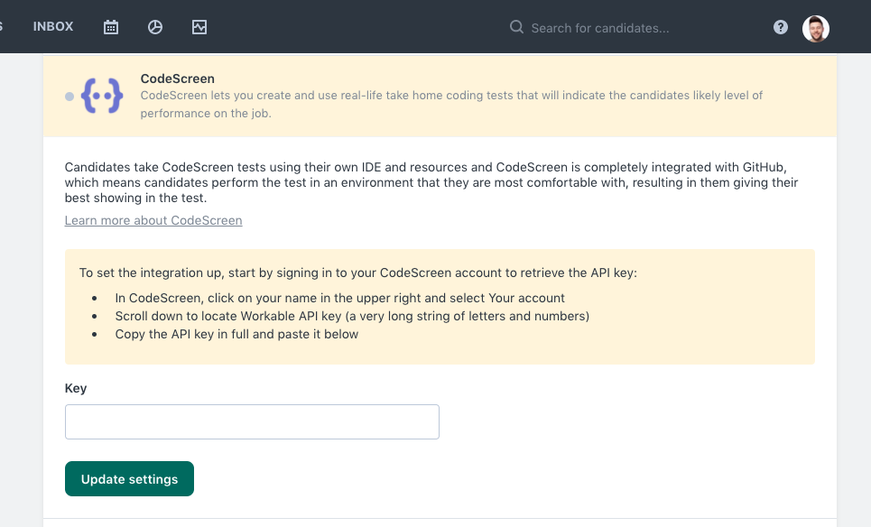
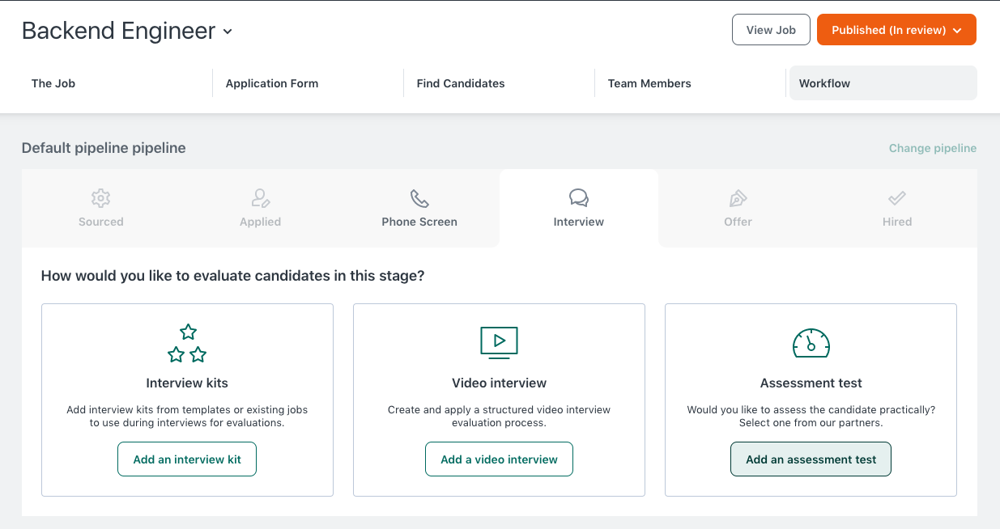
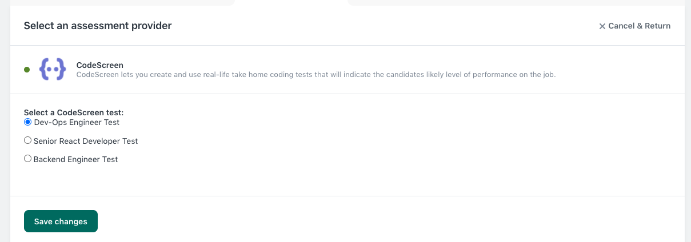
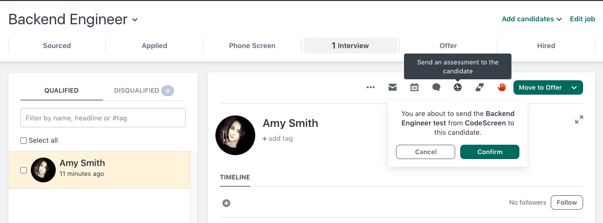
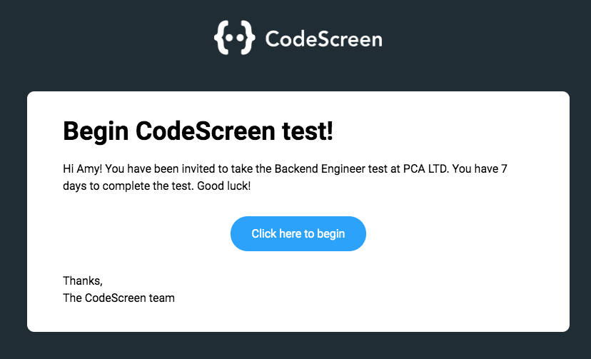
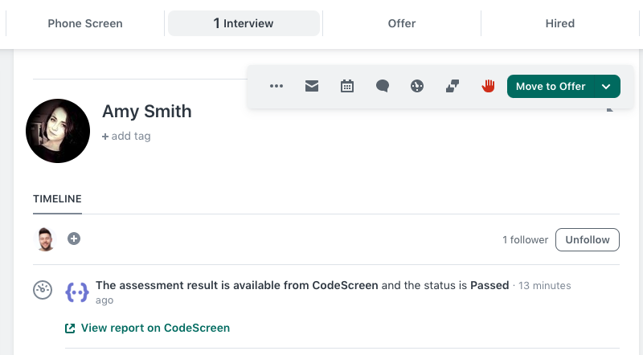
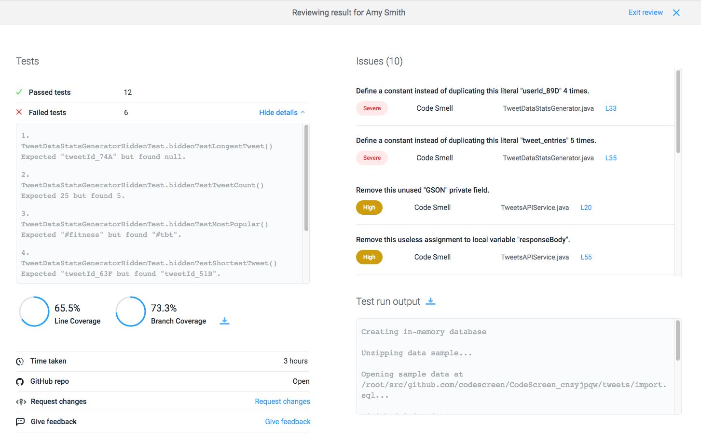

# Integrating Workable with CodeScreen

<figure>
  <figcaption style="font-style: italic;"></figcaption>
   
  
</figure>

The `CodeScreen` integration with `Workable` allows you to do the following:

* Select which CodeScreen test is required for each role you have on Workable.
* Invite candidates to take CodeScreen tests directly from the Workable platform as candidates enter the assessment stage.
* Status updates from invitation to completion.
* Have candidate CodeScreen test reports automatically attach to their Workable candidate profile and their scores displayed.

The integration is quick and straightforward. It works as follows:

### 1. Enable the Workable/CodeScreen Integration
To start, head over to the <a href="https://app.codescreen.dev/#/client-integrations" target="_blank">Integrations</a> section on 
the CodeScreen platform to view your Workable `API key`. Once you have your API key, go to the `Integrations` section on Workable, find CodeScreen in the Assessment Providers section, and enter the API key.

<figure>
  <figcaption style="font-style: italic;"></figcaption>
   
  
</figure>

**Note** that you will not have access to the Integrations section on CodeScreen unless you are an admin user. If you are not
an admin, please contact one of the admin users in your organization, and they will be able to make you an admin.

### 2. Add CodeScreen Stage to Job’s Interview Plan
Once the Workable <> CodeScreen integration is enabled for your organization, you will be able to add a 
CodeScreen assessment to any of your Workable job’s workflow.

To do this for an existing job, navigate to a job, and click into the `Workflow` section, and click the `Add Assessment test` button.

<figure>
  <figcaption style="font-style: italic;"></figcaption>
   
  
</figure>

Now select CodeScreen, and choose from your list of available tests.

There will be one entry in this list for each test that you currently have on CodeScreen.

<figure>
  <figcaption style="font-style: italic;"></figcaption>
   
  
</figure>

### 3. Send and Review the Test
Once a candidate is moved into the stage of the pipeline that you added the CodeScreen assessment to, you can send them the test by clicking the Send test button.

<figure>
  <figcaption style="font-style: italic;"></figcaption>
   
  
</figure>

When you click Send Test, CodeScreen sends an email containing the instructions for the test. 

You are able to edit the email templates that are used to include your own wording and your company’s branding. 
You can read more details about this [here](templates.md). 

The default email template looks like the following:

<figure>
  <figcaption style="font-style: italic;"></figcaption>
   
  
</figure>

Once the candidate has submitted their test, you will be notified via email by Workable, and the result will be viewable on Workable.

<figure>
  <figcaption style="font-style: italic;"></figcaption>
   
  
</figure>

After you click on “View report on CodeScreen”, you’ll be taken to a page similar to the following:

<figure>
  <figcaption style="font-style: italic;"></figcaption>
   
  
</figure>

And that’s it!

A video demo showing the integration in action is available to view 
<a href="https://www.loom.com/share/6f2a08122684481897c3c9d0aac87bd9" target="_blank">here</a>.
